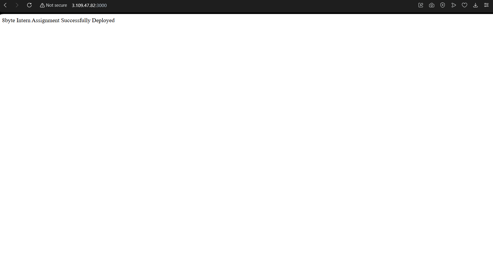
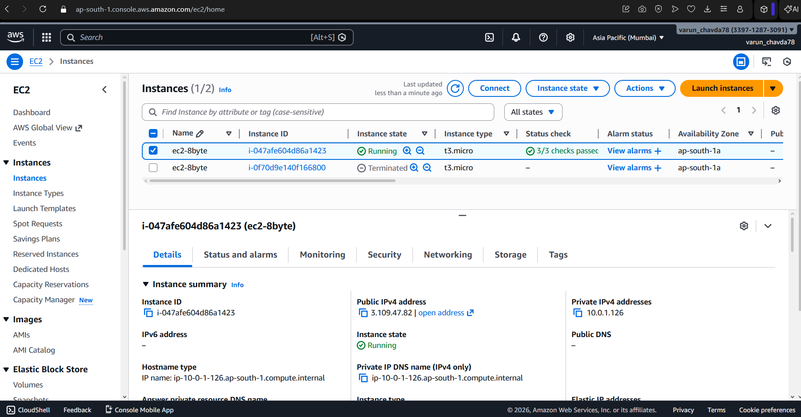
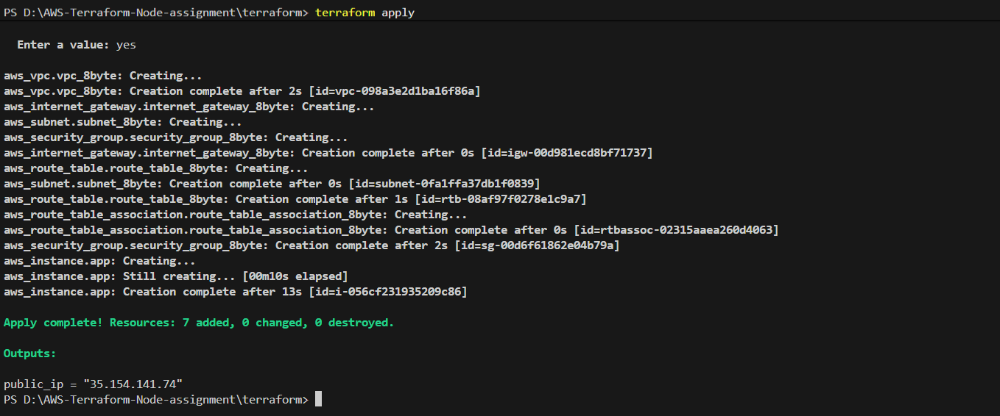
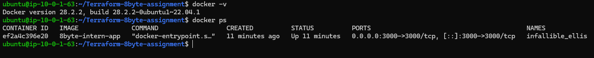
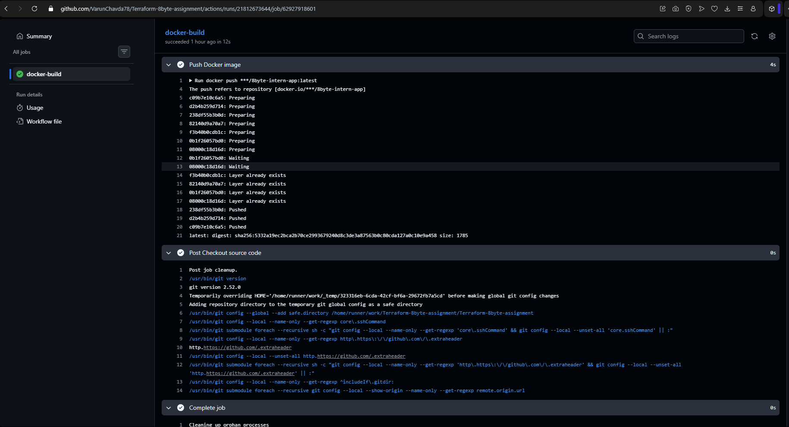

# 8byte DevOps Intern Assignment  
Deploy a Containerized Node.js Application on AWS using Terraform and GitHub Actions

---

## Project Overview

This project demonstrates an end-to-end DevOps workflow for deploying a containerized Node.js application on AWS.  
The setup includes Infrastructure as Code (Terraform), containerization using Docker, and CI automation using GitHub Actions.

The application is deployed on an AWS EC2 instance inside a custom VPC and is accessible publicly via EC2 Public IP.

---

## Technology Stack

- **Cloud Provider:** AWS
- **Infrastructure as Code:** Terraform
- **Containerization:** Docker
- **CI/CD:** GitHub Actions
- **Application:** Node.js (Express)
- **OS:** Ubuntu 22.04
- **Compute:** EC2 (t3.micro)

---

## Architecture Overview
```
Developer
|
| git push
v
GitHub Repository
|
| GitHub Actions (CI)
| - Build Docker Image
v
Docker Image
|
v
AWS EC2 (Ubuntu 22.04)
|
| Docker Container (Node.js App)
v
Public Internet (Port 3000)
```
**Folder Structure**

```
.
├── app.js
├── package.json
├── Dockerfile
├── terraform/
│   ├── main.tf
│   ├── provider.tf
│   ├── variables.tf
│   ├── outputs.tf
│   └── terraform.tfvars
├── .github/
│   └── workflows/
│       └── ci.yml
├── README.md
├── APPROACH.md
└── CHALLENGES.md

````
---
## Steps to Run the Application Locally

### 1️ Install dependencies
npm install

node app.js

http://localhost:3000

---

## Steps to Build & Run Docker Image Locally

### 1️ Build Docker Image

docker build -t 8byte-intern-app .

### 2️ Run Docker Container

docker run -p 3000:3000 -d 8byte-intern-app

---

## Infrastructure Provisioning using Terraform

### 1️ Initialize Terraform
terraform init

### 2️ Plan Terraform
terraform plan

### 3️ Apply Terraform
terraform apply

---

## Deploy Application on EC2

### 1️ SSH into EC2

ssh ubuntu@35.154.141.74

### 2️ Verify Docker installation

docker --version

### 3️ Clone repository or copy source code

git clone https://github.com/VarunChavda78/Terraform-8byte-assignment.git
cd Terraform-8byte-assignment

### 4️ Build Docker image

docker build -t 8byte-intern-app .

### 5️ Run Docker container

docker run -d -p 3000:3000 -d 8byte-intern-app

### 6️ Access application

http://35.154.141.74:3000

---

## Sample Output 





